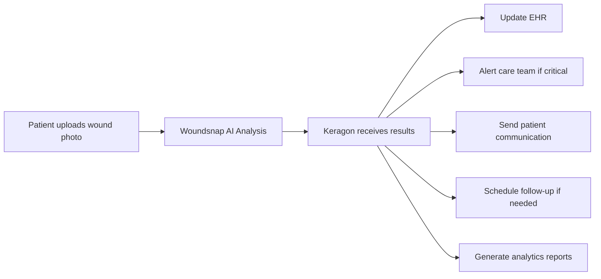

# Keragon Research Report for Woundsnap

*Research conducted for hackathon project: AI-powered wound analysis app*

## Executive Summary

Keragon is a HIPAA-compliant, no-code healthcare automation platform that could significantly enhance Woundsnap's clinical workflows through automated patient data handling, EHR integration, team collaboration, and clinical decision support. With 300+ healthcare integrations and AI-powered workflow capabilities, Keragon offers a comprehensive solution for automating the administrative and clinical processes surrounding wound care analysis.

## Company Overview

### Core Platform
- **HIPAA-compliant automation platform** for healthcare workflows
- **No-code/low-code approach** with visual workflow editor
- **UI-driven workflows** requiring no programming knowledge
- **AI-powered Co-pilot** for faster workflow creation
- **300+ healthcare integrations** including EHRs, PMS, and clinical tools

### Key Statistics
- Over 4 million successfully executed automations
- 300+ healthcare integrations available
- Less than 60 minutes average setup time for first workflow
- SOC2 Type II and HIPAA compliant with regular audits

### Target Markets
- Solo and small medical practices
- Large multi-specialty practices and clinics
- Digital health startups
- Enterprise healthcare organizations and hospitals

## Workflow Automation Capabilities for Woundsnap

### 1. Patient Intake & Data Management
**Relevant for Woundsnap:**
- **Automated patient onboarding**: Sync intake forms with wound assessment platforms
- **Document handling**: Automatically organize wound images, consent forms, treatment plans
- **Data sync**: Populate patient demographics and medical history into Woundsnap
- **Error reduction**: Minimize manual data entry errors in patient records

**Implementation Example:**
```
Patient fills intake form → Keragon extracts relevant data → 
Populates Woundsnap with patient info + medical history → 
Triggers initial wound assessment workflow
```

### 2. EHR Integration & Records Management
**Relevant for Woundsnap:**
- **Bidirectional EHR sync**: Pull patient history relevant to wound care (medications, allergies, previous diagnoses)
- **Automated record updates**: Push wound assessment results, images, and treatment plans back to EHR
- **Clinical data consistency**: Ensure wound care data is synchronized across all platforms
- **Compliance tracking**: Maintain audit trails for wound care documentation

**Implementation Example:**
```
Wound photo captured → AI analysis completed → 
Keragon automatically updates EHR with:
- Wound assessment results
- Treatment recommendations
- Progress photos
- Next appointment scheduling
```

### 3. Clinical Workflow Automation
**Relevant for Woundsnap:**
- **Triage & routing**: Automatically route critical wound findings to appropriate specialists
- **Real-time alerts**: Notify care teams of significant wound status changes
- **AI-driven summaries**: Generate wound progress summaries for clinical review
- **Symptom-based follow-ups**: Trigger alerts based on specific wound characteristics

**Implementation Example:**
```
Woundsnap detects infection risk → Keragon immediately:
- Alerts wound care specialist
- Schedules urgent follow-up
- Generates alert summary for care team
- Documents findings in patient record
```

### 4. Patient Communication & Engagement
**Relevant for Woundsnap:**
- **Automated reminders**: Send wound care instructions, medication reminders
- **Progress tracking prompts**: Remind patients to upload new wound images
- **Personalized follow-ups**: AI-powered messages based on wound healing progress
- **Appointment automation**: Schedule follow-ups based on wound assessment results

**Implementation Example:**
```
Wound showing positive healing → Keragon sends:
- Encouraging progress message to patient
- Reminder to continue treatment protocol
- Prompt to upload next progress photo
- Automatic scheduling of next check-in
```

### 5. Analytics & Reporting
**Relevant for Woundsnap:**
- **Real-time dashboards**: Stream wound assessment data to monitoring dashboards
- **Treatment effectiveness tracking**: Aggregate data on healing outcomes
- **AI insights**: Identify trends in wound healing and treatment success
- **Compliance reporting**: Generate reports for regulatory requirements

## Integration Architecture for Woundsnap

### Core Integration Points
1. **EHR Systems**: Epic, Cerner, Athenahealth, Elation Health
2. **Patient Communication**: Twilio, Spruce Health, email/SMS platforms
3. **Document Management**: DocuSign, Dropbox Sign, secure file storage
4. **Billing Systems**: Candidhealth, Balance, insurance verification
5. **AI/ML Services**: OpenAI, Anthropic (Claude), Google AI Studio
6. **Cloud Infrastructure**: AWS, Google Cloud, Microsoft Azure

### Woundsnap-Specific Workflow


## Technical Implementation

### API & Integration Capabilities
- **300+ pre-built integrations** available immediately
- **REST API access** for custom integrations (implied from developer tools)
- **Webhook support** for real-time event handling
- **Universal HTTP connector** for systems without pre-built integrations
- **AI model integrations** (OpenAI, Claude, Google AI) for enhanced processing

### Developer Resources
- **Visual workflow builder** with drag-and-drop interface
- **AI Co-pilot** for automated workflow generation
- **Template library** with healthcare-specific workflows
- **Getting started tutorials** and comprehensive documentation
- **Community forum** and expert marketplace for support

### Security & Compliance
- **HIPAA compliance** with Business Associate Agreements (BAA)
- **SOC2 Type II certification** with regular audits
- **Encrypted secrets store** for API keys and credentials
- **Audit logs** for all workflow executions
- **AWS hosting** with static public IPs

## Pricing Structure

### Plan Comparison for Woundsnap

| Feature | Starter ($99/mo annual) | Professional ($269/mo annual) | Scale Up ($995/mo annual) |
|---------|------------------------|------------------------------|--------------------------|
| **Published Workflows** | 3 | 15 | 100 |
| **Monthly Workflow Runs** | 200 | 2,000 | 20,000 |
| **Extra Runs Cost** | $0.15 each | $0.07 each | $0.02 each |
| **Support Level** | Self-help | Standard | Priority |
| **Minimum Polling** | 5 minutes | 5 minutes | 1 minute |
| **Best For Woundsnap** | MVP testing | Early growth | Production scale |

### Cost Analysis for Woundsnap
- **Early development**: Starter plan adequate for MVP with basic workflows
- **Growth phase**: Professional plan supports moderate patient volume
- **Scale deployment**: Scale Up plan handles significant patient loads
- **Enterprise**: Custom pricing for hospital-wide implementations

### Free Trial
- **14-day free trial** available with full feature access
- **No credit card required** for initial testing
- **Perfect for hackathon validation** and proof of concept

## Woundsnap Implementation Strategy

### Phase 1: MVP Development (Starter Plan)
1. **Patient intake automation**: Streamline onboarding process
2. **Basic EHR integration**: Connect with primary EHR system
3. **Simple alerts**: Notify clinicians of completed wound analyses

### Phase 2: Clinical Integration (Professional Plan)
1. **Advanced EHR sync**: Bidirectional data flow with patient history
2. **Care team alerts**: Automated routing based on wound severity
3. **Patient communication**: Automated follow-ups and reminders
4. **Progress tracking**: Wound healing timeline automation

### Phase 3: Full Automation (Scale Up Plan)
1. **AI-powered workflows**: Intelligent decision trees based on wound characteristics
2. **Comprehensive reporting**: Analytics dashboard for clinical insights
3. **Multi-provider support**: Workflows for complex care teams
4. **Predictive analytics**: Early intervention triggers

## Competitive Advantages for Woundsnap

### 1. No-Code Implementation
- **Rapid deployment**: Set up workflows in under 60 minutes
- **No engineering overhead**: Clinical staff can modify workflows
- **Faster iteration**: Quick adjustments based on user feedback

### 2. Healthcare-Specific Features
- **HIPAA compliance** built-in, critical for medical applications
- **Clinical workflow templates** accelerate implementation
- **EHR integrations** essential for healthcare adoption

### 3. AI Integration
- **AI Co-pilot** for workflow optimization
- **Machine learning model integration** enhances Woundsnap's capabilities
- **Intelligent automation** based on clinical patterns

### 4. Scalability
- **Elastic infrastructure** handles varying patient loads
- **Volume pricing** reduces costs as usage increases
- **Enterprise features** support large-scale deployments

## Hackathon Implementation Plan

### Immediate Steps (Day 1-2)
1. **Sign up for free trial**: Test Keragon platform capabilities
2. **Explore templates**: Review healthcare automation examples
3. **Design core workflows**: Map Woundsnap processes to Keragon capabilities

### Development Phase (Day 3-4)
1. **Build patient intake workflow**: Automate data collection and validation
2. **Create EHR integration**: Mock connection to demonstrate data flow
3. **Implement alert system**: Showcase clinical decision support

### Demo Preparation (Day 5)
1. **End-to-end workflow**: Patient upload → Analysis → Clinical action
2. **Dashboard creation**: Show real-time wound care analytics
3. **Integration showcase**: Demonstrate seamless EHR connectivity

## Documentation & Resources

### Official Documentation
- **Main Website**: https://www.keragon.com/
- **Healthcare Automation**: https://www.keragon.com/healthcare-automation
- **Pricing**: https://www.keragon.com/pricing
- **Developer Tools**: https://www.keragon.com/software/developer-tools

### Key Resources
- **Getting Started Guide**: Step-by-step workflow creation tutorial
- **Integration Directory**: 300+ available healthcare integrations
- **Community Forum**: Peer support and best practices
- **Expert Marketplace**: Professional implementation assistance

### Support Channels
- **Free trial**: 14-day full access without credit card
- **Self-help resources**: FAQ and knowledge base
- **Community support**: Forum for peer assistance
- **Standard support**: Email support for paid plans

## Conclusion & Recommendations

Keragon presents an exceptional opportunity for Woundsnap to automate complex healthcare workflows without significant development overhead. The platform's HIPAA compliance, extensive EHR integrations, and AI-powered capabilities align perfectly with Woundsnap's needs for clinical workflow automation.

### Key Benefits for Woundsnap:
1. **Accelerated development**: No-code approach reduces time to market
2. **Healthcare compliance**: Built-in HIPAA and SOC2 compliance
3. **Seamless integration**: 300+ healthcare tool connections
4. **Scalable pricing**: Plans that grow with user adoption
5. **AI enhancement**: Intelligent workflows improve clinical outcomes

### Recommended Approach:
1. **Start with free trial** during hackathon development
2. **Focus on core workflows**: Patient intake, EHR sync, clinical alerts
3. **Demonstrate value proposition**: Show automated clinical decision support
4. **Plan for scaling**: Design workflows that handle growth from MVP to enterprise

Keragon could transform Woundsnap from a standalone analysis tool into a comprehensive wound care workflow platform, significantly enhancing its value proposition for healthcare providers and improving patient outcomes through automated clinical processes.
